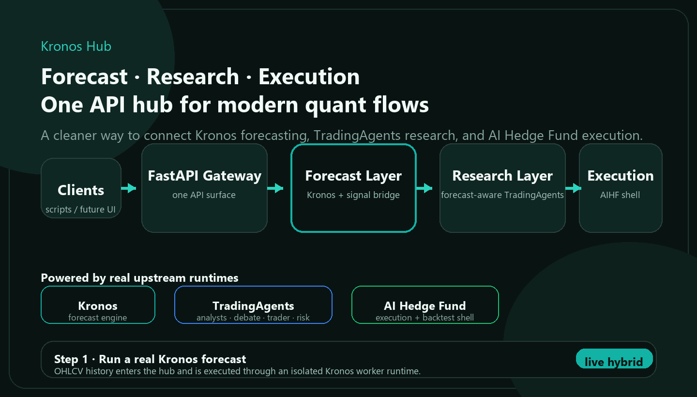
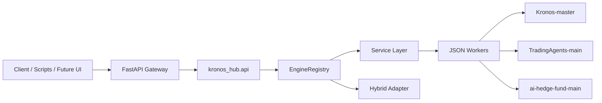

# Kronos Hub

[](https://github.com/b1ue13e/kronos-hub/stargazers)
[](https://github.com/b1ue13e/kronos-hub/blob/main/LICENSE)
[](https://b1ue13e.github.io/kronos-hub/)
[](https://www.python.org/)
[](https://fastapi.tiangolo.com/)

**Forecasting + multi-agent research + execution/backtesting, unified under one integration-first API hub.**

Kronos Hub connects:

- `Kronos` for OHLCV forecasting
- `TradingAgents` for multi-agent research and debate
- `AI Hedge Fund` for execution and backtesting

Instead of smashing three codebases into one fragile runtime, it adds a worker-based orchestration layer and a single API surface on top of existing projects.

**Quick links:** [Hosted Docs](https://b1ue13e.github.io/kronos-hub/) · [Architecture](docs/architecture.md) · [API](docs/api.md) · [Hybrid Demo](examples/requests/hybrid.demo.template.json) · [中文说明](#中文说明)

[](https://b1ue13e.github.io/kronos-hub/)

## What You Can Do Today

The current workspace already supports real worker-backed routes for:

| Route | Purpose | Status |
| --- | --- | --- |
| `POST /predictions/kronos` | Single-series OHLCV forecasting | Live |
| `POST /predictions/kronos/batch` | Batch OHLCV forecasting | Live |
| `POST /research/tradingagents` | Multi-agent research and decision generation | Live |
| `POST /execution/ai-hedge-fund/run` | Analysis / execution flow | Live |
| `POST /execution/ai-hedge-fund/backtest` | Backtesting flow | Live |
| `POST /runs` | Unified engine entrypoint | Live |

New in this repo:

- a **minimal hybrid demo chain** that executes a real Kronos forecast and synthesizes a structured signal in the hub
- optional fan-out into `TradingAgents` research and `AI Hedge Fund` execution/backtesting when credentials are available
- GitHub Pages-ready docs and a public-facing repo structure designed for discoverability

## Why This Repo Exists

These upstream projects are complementary, but they are not packaged around the same boundary:

- `Kronos` behaves like a forecasting engine and model toolkit
- `TradingAgents` behaves like a reusable research engine
- `AI Hedge Fund` behaves like an execution, backtesting, and app shell

Kronos Hub turns them into one extensible workspace with:

- a shared FastAPI gateway
- a unified engine registry
- subprocess worker isolation for dependency conflicts
- runnable request templates and PowerShell scripts
- a bridge layer for forecast -> research -> execution orchestration

## Minimal Hybrid Demo

The new `hybrid` mode is no longer only a placeholder.

**Minimal demo path**

1. Run a real `Kronos` forecast from OHLCV history.
2. Build a hub-side signal summary from forecast output.
3. Optionally expand into `TradingAgents` research.
4. Optionally expand into `AI Hedge Fund` execution or backtesting.

Use the demo template:

- [hybrid.demo.template.json](examples/requests/hybrid.demo.template.json)

Or the runnable script:

```powershell
.\examples\scripts\invoke-hybrid-demo.ps1
```

With optional expansion:

```powershell
.\examples\scripts\invoke-hybrid-demo.ps1 -EnableResearch
.\examples\scripts\invoke-hybrid-demo.ps1 -EnableResearch -EnableExecution
```

## Why Not Just Use The Upstream Repos?

You absolutely can, and for some users that is still the right choice.

But this repo becomes interesting when you want one or more of these:

- one API surface instead of three unrelated entrypoints
- one place to inspect project availability, health, and orchestration paths
- isolated workers for conflicting dependencies instead of a risky merged environment
- a bridge layer where forecast outputs can be normalized before research/execution
- a future product surface that can evolve into one coherent quant workflow

In short:

- use the upstream repos if you want each tool on its own
- use `Kronos Hub` if you want an integration layer and an eventual unified platform

## Architecture At A Glance



The request flow is intentionally simple:

1. A client hits the unified hub API.
2. The API layer validates and translates the request.
3. The service layer builds a worker payload.
4. A dedicated worker process enters the target subproject.
5. Results are normalized back into a single JSON contract.

## Quick Start

### 1. Create a local env file

```powershell
Copy-Item .env.example .env
```

### 2. Install hub dependencies

```powershell
pip install -e .
```

Or bootstrap a dedicated hub environment:

```powershell
.\scripts\bootstrap_hub.ps1
```

### 3. Run self-checks

```powershell
python .\scripts\smoke_check.py
python -m unittest
```

### 4. Start the API gateway

```powershell
python -m uvicorn apps.api_gateway.main:app --reload --port 8010
```

Or:

```powershell
.\scripts\run_api.ps1
```

Then open:

- `http://127.0.0.1:8010/`
- `http://127.0.0.1:8010/docs`

## Multi-Interpreter Setup

The recommended setup is to give each vendored project its own Python environment, then point the hub at each interpreter:

```text
KRONOS_HUB_KRONOS_PYTHON
KRONOS_HUB_TRADINGAGENTS_PYTHON
KRONOS_HUB_AI_HEDGE_FUND_PYTHON
```

This keeps:

- LangGraph / LangChain conflicts contained
- Kronos model dependencies isolated
- integration work moving without forcing a risky full refactor

## Repo Layout

```text
F:\kronos
├─ ai-hedge-fund-main/      # vendored execution / backtesting app
├─ TradingAgents-main/      # vendored multi-agent research engine
├─ Kronos-master/           # vendored OHLCV forecasting project
├─ apps/
│  └─ api_gateway/          # external FastAPI entrypoint
├─ docs/
│  ├─ api.md
│  ├─ architecture.md
│  ├─ development.md
│  ├─ github-branding.md
│  └─ index.html            # GitHub Pages-ready docs landing page
├─ examples/
│  ├─ requests/
│  └─ scripts/
├─ kronos_hub/
│  ├─ api/
│  ├─ engines/
│  ├─ services/
│  ├─ shared/
│  └─ workers/
├─ scripts/
├─ tests/
└─ README.md
```

## Example Requests

The repo already includes runnable request templates and PowerShell scripts:

- [examples/README.md](examples/README.md)
- `examples/requests/*.json`
- `examples/scripts/*.ps1`

Common entrypoints:

```powershell
.\examples\scripts\invoke-kronos-sample.ps1
.\examples\scripts\invoke-hybrid-demo.ps1
.\examples\scripts\invoke-tradingagents-sample.ps1
.\examples\scripts\invoke-aihf-run-sample.ps1
.\examples\scripts\invoke-aihf-backtest-sample.ps1
```

## Current Limits

This repo already unifies three working capability layers, but deeper product integration is still ahead:

- `TradingAgents` is not yet natively forecast-aware end-to-end
- `hybrid` currently uses hub-side signal synthesis as the bridge
- `AI Hedge Fund` is not yet fully re-centered around the hub gateway
- a unified UI, result store, and logging layer are still future work

## Why It Can Be Interesting

For open-source users, this repo is valuable in at least three ways:

- as a practical reference for integrating heterogeneous AI/quant projects without a full rewrite
- as a working FastAPI + subprocess worker orchestration example
- as a foundation for building a forecasting-aware research and execution stack

## Roadmap

The highest-leverage next steps are:

1. Make `hybrid` perform a deeper forecast-aware research handoff inside upstream reasoning graphs.
2. Define a shared signal schema between forecast and research layers.
3. Route more of the execution and UI surface through the hub gateway.
4. Add unified storage, logging, and visualization for results.
5. Publish a lightweight live demo or hosted sandbox beyond docs-only Pages.

## Docs

- [Hosted Docs](https://b1ue13e.github.io/kronos-hub/)
- [docs/architecture.md](docs/architecture.md): architecture and runtime boundaries
- [docs/api.md](docs/api.md): routes and request payloads
- [docs/development.md](docs/development.md): local development workflow
- [docs/github-branding.md](docs/github-branding.md): GitHub About / Topics / Website suggestions
- [CONTRIBUTING.md](CONTRIBUTING.md): contribution guidance
- [SECURITY.md](SECURITY.md): security reporting guidance
- [THIRD_PARTY_NOTICES.md](THIRD_PARTY_NOTICES.md): third-party code and license boundaries
- [MERGE_ASSESSMENT.md](MERGE_ASSESSMENT.md): original integration strategy notes

## License Notes

The root integration layer is licensed under Apache-2.0. Vendored upstream directories keep their own licenses and notices. Read [THIRD_PARTY_NOTICES.md](THIRD_PARTY_NOTICES.md) before redistributing the full repository.

## Disclaimer

This repository is for research, engineering integration, and educational use. It is not investment advice.

---

## 中文说明

`Kronos Hub` 是一个面向量化研究与策略执行场景的集成式 Hub，用统一 API 把下面三个独立项目接到同一套工作流里：

- `Kronos-master`: 金融时间序列 OHLCV 预测模型
- `TradingAgents-main`: 多代理研究与辩论引擎
- `ai-hedge-fund-main`: 执行、回测、后端和前端应用壳

这不是把三套代码强行揉成一个单体应用，而是一个 integration-first 的总控层：上层统一接口，下层隔离运行时。

### 当前状态

- `Kronos` 已通过 worker 封装为统一预测服务
- `TradingAgents` 已通过 worker 接为真实研究引擎
- `ai-hedge-fund` 已通过 worker 接为执行 / 回测壳
- `hybrid` 已经具备最小可演示链路：真实 forecast + hub-side signal synthesis + 可选 research/execution

### 为什么采用 Hub + Worker

- `TradingAgents` 和 `ai-hedge-fund` 的 LangGraph / LangChain 版本并不一致
- `Kronos` 偏 PyTorch / Hugging Face 模型推理
- 三者产品边界不同，一个像模型工具箱，一个像研究引擎，一个像应用壳

所以 Hub 采用：

- 上层统一：FastAPI 网关、引擎注册表、共享请求 / 响应模型
- 下层隔离：每个子项目可以绑定自己的 Python 解释器
- 调度方式：通过 `subprocess` worker 直接调用真实项目代码

### 最小 Hybrid 演示

```powershell
.\examples\scripts\invoke-hybrid-demo.ps1
```

扩展到研究 / 执行：

```powershell
.\examples\scripts\invoke-hybrid-demo.ps1 -EnableResearch
.\examples\scripts\invoke-hybrid-demo.ps1 -EnableResearch -EnableExecution
```

### 关键文档

- [Hosted Docs](https://b1ue13e.github.io/kronos-hub/)
- [docs/architecture.md](docs/architecture.md)
- [docs/api.md](docs/api.md)
- [docs/development.md](docs/development.md)

### 当前边界

- `TradingAgents` 还没有真正把 forecast context 深度写进上游 reasoning graph
- `hybrid` 当前仍以 Hub 侧信号桥接为主
- `ai-hedge-fund` 还没有完全以 Hub 网关作为统一后端
- 统一日志、统一回测结果视图、统一前端入口仍是下一阶段工作
