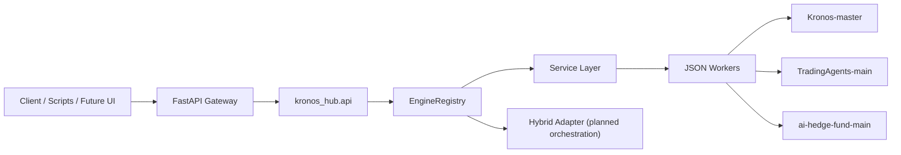

# Kronos Hub

An integration-first quant platform that connects:

- `Kronos` for OHLCV forecasting
- `TradingAgents` for multi-agent research and debate
- `AI Hedge Fund` for execution and backtesting

`Kronos Hub` does not try to smash three codebases into one fragile Python runtime. Instead, it adds a unified API and worker-based orchestration layer on top of existing projects.

[中文说明](#中文说明)

## Why This Repo Exists

These three projects are naturally complementary, but they are not packaged around the same boundary:

- `Kronos` behaves like a forecasting engine and model toolkit
- `TradingAgents` behaves like a reusable research engine
- `AI Hedge Fund` behaves like an execution, backtesting, and application shell

This repository turns them into one extensible workspace with:

- a shared FastAPI gateway
- a unified engine registry
- subprocess worker isolation for dependency conflicts
- example requests and scripts for end-to-end testing
- a planned `hybrid` pipeline for forecast -> research -> execution flows

## What Works Today

The current workspace already supports real worker-backed routes for:

| Route | Purpose | Status |
| --- | --- | --- |
| `POST /predictions/kronos` | Single-series OHLCV forecasting | Live |
| `POST /predictions/kronos/batch` | Batch OHLCV forecasting | Live |
| `POST /research/tradingagents` | Multi-agent research and decision generation | Live |
| `POST /execution/ai-hedge-fund/run` | Analysis / execution flow | Live |
| `POST /execution/ai-hedge-fund/backtest` | Backtesting flow | Live |
| `POST /runs` | Unified engine entrypoint | Live |
| `GET /engines` | Engine discovery | Live |
| `GET /projects` | Vendored subproject discovery | Live |
| `GET /health` | Hub health check | Live |

## Architecture At A Glance



The request flow is intentionally simple:

1. A client hits the unified hub API.
2. The API layer validates and translates the request.
3. The service layer builds a worker payload.
4. A dedicated worker process enters the target subproject.
5. Results are normalized back into a single JSON response contract.

## Repo Layout

```text
F:\kronos
├─ ai-hedge-fund-main/      # vendored execution / backtesting app
├─ TradingAgents-main/      # vendored multi-agent research engine
├─ Kronos-master/           # vendored OHLCV forecasting project
├─ apps/
│  └─ api_gateway/          # external FastAPI entrypoint
├─ docs/
│  ├─ api.md
│  ├─ architecture.md
│  └─ development.md
├─ examples/
│  ├─ requests/             # JSON request templates
│  └─ scripts/              # PowerShell invocation scripts
├─ kronos_hub/
│  ├─ api/
│  ├─ engines/
│  ├─ services/
│  ├─ shared/
│  └─ workers/
├─ scripts/
├─ tests/
└─ README.md
```

## Quick Start

### 1. Create a local env file

```powershell
Copy-Item .env.example .env
```

### 2. Install hub dependencies

```powershell
pip install -e .
```

Or bootstrap a dedicated hub environment:

```powershell
.\scripts\bootstrap_hub.ps1
```

### 3. Run self-checks

```powershell
python .\scripts\smoke_check.py
python -m unittest
```

### 4. Start the API gateway

```powershell
python -m uvicorn apps.api_gateway.main:app --reload --port 8010
```

Or:

```powershell
.\scripts\run_api.ps1
```

Then open:

- `http://127.0.0.1:8010/`
- `http://127.0.0.1:8010/docs`

## Multi-Interpreter Setup

The recommended setup is to give each vendored project its own Python environment, then point the hub at each interpreter:

```text
KRONOS_HUB_KRONOS_PYTHON
KRONOS_HUB_TRADINGAGENTS_PYTHON
KRONOS_HUB_AI_HEDGE_FUND_PYTHON
```

This keeps:

- LangGraph / LangChain conflicts contained
- Kronos model dependencies isolated
- integration work moving without forcing a risky full refactor

## Example Requests

The repo already includes runnable request templates and PowerShell scripts:

- [examples/README.md](examples/README.md)
- `examples/requests/*.json`
- `examples/scripts/*.ps1`

Common examples:

```powershell
.\examples\scripts\invoke-kronos-sample.ps1
.\examples\scripts\invoke-tradingagents-sample.ps1
.\examples\scripts\invoke-aihf-run-sample.ps1
.\examples\scripts\invoke-aihf-backtest-sample.ps1
```

## Current Limits

This repo already unifies three working capability layers, but the deeper product integration is still ahead:

- `hybrid` is scaffolded, not fully runtime-connected
- `TradingAgents` is not yet forecast-aware by default
- `AI Hedge Fund` is not yet fully re-centered around the hub gateway
- a unified UI, result store, and logging layer are still future work

## Why It Can Be Interesting

For open-source users, this repo is valuable in at least three ways:

- as a practical reference for integrating heterogeneous AI/quant projects without a full rewrite
- as a working FastAPI + subprocess worker orchestration example
- as a foundation for building a forecasting-aware research and execution stack

## Roadmap

The highest-leverage next steps are:

1. Make `hybrid` perform a real end-to-end runtime chain.
2. Define a shared signal schema between forecast and research layers.
3. Add forecast-aware tools or analysts inside `TradingAgents`.
4. Route more of the execution and UI surface through the hub gateway.
5. Add unified storage, logging, and visualization for results.

## Docs

- [docs/architecture.md](docs/architecture.md): architecture and runtime boundaries
- [docs/api.md](docs/api.md): routes and request payloads
- [docs/development.md](docs/development.md): local development workflow
- [docs/github-branding.md](docs/github-branding.md): GitHub About / Topics / Website suggestions
- [CONTRIBUTING.md](CONTRIBUTING.md): contribution guidance
- [SECURITY.md](SECURITY.md): security reporting guidance
- [THIRD_PARTY_NOTICES.md](THIRD_PARTY_NOTICES.md): third-party code and license boundaries
- [MERGE_ASSESSMENT.md](MERGE_ASSESSMENT.md): original integration strategy notes

## License Notes

The root integration layer is licensed under Apache-2.0. Vendored upstream directories keep their own licenses and notices. Read [THIRD_PARTY_NOTICES.md](THIRD_PARTY_NOTICES.md) before redistributing the full repository.

## Disclaimer

This repository is for research, engineering integration, and educational use. It is not investment advice.

---

## 中文说明

`Kronos Hub` 是一个面向量化研究与策略执行场景的集成式 Hub，用统一 API 把下面三个独立项目接到同一套工作流里：

- `Kronos-master`: 金融时间序列 OHLCV 预测模型
- `TradingAgents-main`: 多代理研究与辩论引擎
- `ai-hedge-fund-main`: 执行、回测、后端和前端应用壳

这不是把三套代码强行揉成一个单体应用，而是一个 integration-first 的总控层：上层统一接口，下层隔离运行时。

### 当前状态

- `Kronos` 已通过 worker 封装为统一预测服务
- `TradingAgents` 已通过 worker 接为真实研究引擎
- `ai-hedge-fund` 已通过 worker 接为执行 / 回测壳
- `hybrid` 引擎已定义三阶段流水线，但还未完成端到端串联

### 为什么采用 Hub + Worker

- `TradingAgents` 和 `ai-hedge-fund` 的 LangGraph / LangChain 版本并不一致
- `Kronos` 偏 PyTorch / Hugging Face 模型推理
- 三者产品边界不同，一个像模型工具箱，一个像研究引擎，一个像应用壳

所以 Hub 采用：

- 上层统一：FastAPI 网关、引擎注册表、共享请求 / 响应模型
- 下层隔离：每个子项目可以绑定自己的 Python 解释器
- 调度方式：通过 `subprocess` worker 直接调用真实项目代码

### 快速开始

```powershell
Copy-Item .env.example .env
pip install -e .
python .\scripts\smoke_check.py
python -m uvicorn apps.api_gateway.main:app --reload --port 8010
```

### 关键文档

- [docs/architecture.md](docs/architecture.md)
- [docs/api.md](docs/api.md)
- [docs/development.md](docs/development.md)

### 当前边界

- `hybrid` 还没有真正串起预测 -> 研究 -> 执行
- `TradingAgents` 还没有显式接收来自 `Kronos` 的共享信号
- `ai-hedge-fund` 还没有完全以 Hub 网关作为统一后端
- 统一日志、统一回测结果视图、统一前端入口仍是下一阶段工作
