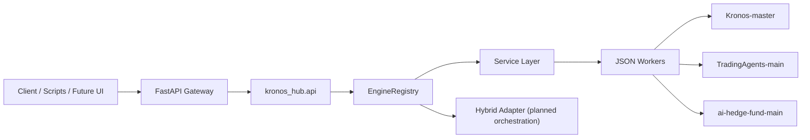

# Kronos Hub

一个面向量化研究与策略执行场景的集成式 Hub，用统一 API 把下面三个独立项目接入同一套工作流：

- `Kronos-master`: 金融时间序列 OHLCV 预测模型
- `TradingAgents-main`: 多代理研究与辩论引擎
- `ai-hedge-fund-main`: 执行、回测、后端和前端应用壳

这不是把三套代码强行揉成一个单体应用，而是一个 integration-first 的总控层：上层统一接口，下层隔离运行时。

## 项目目标

这套仓库要解决的问题不是“再造一个量化框架”，而是把已经各自成型的三个项目组织成一个可继续演进的平台：

- 用 `Kronos` 提供结构化预测能力
- 用 `TradingAgents` 产出研究结论、辩论结果和交易判断
- 用 `ai-hedge-fund` 承接执行、回测和潜在 UI 展示
- 用 `kronos_hub` 提供统一 API、统一契约和统一调度入口

## 当前状态

当前版本已经不是目录骨架，而是完成了第一轮真实接线：

- `Kronos` 已通过 worker 封装为统一预测服务
- `TradingAgents` 已通过 worker 接为真实研究引擎
- `ai-hedge-fund` 已通过 worker 接为执行 / 回测壳
- `hybrid` 引擎已定义三阶段流水线，但还未完成端到端串联

## 为什么采用 Hub + Worker

三个子项目依赖栈差异明显：

- `TradingAgents` 和 `ai-hedge-fund` 的 LangGraph / LangChain 版本并不一致
- `Kronos` 偏 PyTorch / Hugging Face 模型推理
- 三者产品边界不同，一个像模型工具箱，一个像研究引擎，一个像应用壳

因此 Hub 选择了更稳妥的架构：

- 上层统一：FastAPI 网关、引擎注册表、共享请求/响应模型
- 下层隔离：每个子项目可以绑定自己的 Python 解释器
- 调度方式：通过 `subprocess` worker 直接调用真实项目代码，而不是把三套依赖塞进同一个进程

## 架构概览



请求的典型执行路径是：

1. 客户端调用统一路由。
2. FastAPI 路由把请求转成领域模型或服务调用。
3. 服务层把参数整理为 worker payload。
4. worker 使用独立解释器进入目标子项目。
5. 子项目返回结果后，由 Hub 统一封装为 JSON 响应。

## 仓库结构

```text
F:\kronos
├─ ai-hedge-fund-main/      # 上游执行/回测应用
├─ TradingAgents-main/      # 上游多代理研究引擎
├─ Kronos-master/           # 上游 OHLCV 预测模型
├─ apps/
│  └─ api_gateway/          # 对外 FastAPI 入口
├─ docs/
│  ├─ api.md
│  ├─ architecture.md
│  └─ development.md
├─ examples/
│  ├─ requests/             # API 请求模板
│  └─ scripts/              # PowerShell 示例脚本
├─ kronos_hub/
│  ├─ api/                  # 路由与请求模型
│  ├─ engines/              # 引擎注册与适配器
│  ├─ services/             # 服务层，负责拼装 worker payload
│  ├─ shared/               # 共享契约、路径发现、worker 客户端
│  └─ workers/              # 真实进入各子项目代码的桥接层
├─ scripts/                 # 启动与自检脚本
├─ tests/                   # Hub 自身测试
├─ CONTRIBUTING.md
├─ SECURITY.md
├─ THIRD_PARTY_NOTICES.md
└─ README.md
```

## 目前可用的 API 能力

这些路由已经接入真实 worker：

| Route | 作用 | 状态 |
| --- | --- | --- |
| `POST /predictions/kronos` | 单序列 OHLCV 预测 | 已接通 |
| `POST /predictions/kronos/batch` | 批量 OHLCV 预测 | 已接通 |
| `POST /research/tradingagents` | 多代理研究与交易结论生成 | 已接通 |
| `POST /execution/ai-hedge-fund/run` | 执行 / 分析流程 | 已接通 |
| `POST /execution/ai-hedge-fund/backtest` | 回测流程 | 已接通 |
| `POST /runs` | 通用引擎调用入口 | 已接通 |
| `GET /engines` | 查看可用引擎 | 已接通 |
| `GET /projects` | 查看子项目发现状态 | 已接通 |
| `GET /health` | Hub 健康检查 | 已接通 |

更细的接口说明见 [docs/api.md](docs/api.md)。

## 快速开始

### 1. 准备环境变量

复制并填写根目录的环境变量模板：

```powershell
Copy-Item .env.example .env
```

如果三个子项目就在当前仓库根目录下，可以先不配置路径变量；如果它们各自有独立虚拟环境，建议在 `.env` 中配置：

```text
KRONOS_HUB_AI_HEDGE_FUND_PYTHON
KRONOS_HUB_TRADINGAGENTS_PYTHON
KRONOS_HUB_KRONOS_PYTHON
```

### 2. 安装 Hub 自身依赖

```powershell
pip install -e .
```

或者直接创建一个 Hub 专用环境：

```powershell
.\scripts\bootstrap_hub.ps1
```

### 3. 运行自检

```powershell
python .\scripts\smoke_check.py
python -m unittest
```

### 4. 启动 API 网关

```powershell
python -m uvicorn apps.api_gateway.main:app --reload --port 8010
```

或者：

```powershell
.\scripts\run_api.ps1
```

启动后可以访问：

- `http://127.0.0.1:8010/`
- `http://127.0.0.1:8010/docs`

## 独立解释器配置

推荐给三个子项目分别准备独立 Python 环境，再把环境变量指向对应解释器：

```text
KRONOS_HUB_KRONOS_PYTHON
KRONOS_HUB_TRADINGAGENTS_PYTHON
KRONOS_HUB_AI_HEDGE_FUND_PYTHON
```

这样做的好处是：

- 降低 LangGraph / LangChain 版本冲突
- 保持 `Kronos` 的模型依赖独立
- 减少为了“合并”而重写上游项目的成本

## 示例请求

根目录已经提供了可直接参考的请求模板和 PowerShell 调用脚本：

- [examples/README.md](examples/README.md)
- `examples/requests/*.json`
- `examples/scripts/*.ps1`

常用示例：

```powershell
.\examples\scripts\invoke-kronos-sample.ps1
.\examples\scripts\invoke-tradingagents-sample.ps1
.\examples\scripts\invoke-aihf-run-sample.ps1
.\examples\scripts\invoke-aihf-backtest-sample.ps1
```

## 当前边界

Hub 现在已经具备“统一调度三套能力”的基础能力，但还没有完成更深层的业务融合：

- `hybrid` 还没有真正串起预测 -> 研究 -> 执行
- `TradingAgents` 还没有显式接收来自 `Kronos` 的共享信号
- `ai-hedge-fund` 还没有完全以 Hub 网关作为统一后端
- 统一日志、统一回测结果视图、统一前端入口仍是下一阶段工作

## Roadmap

建议优先往这几个方向推进：

1. 补齐 `hybrid` 的真实端到端执行链。
2. 定义预测输出到研究输入之间的共享信号 schema。
3. 为 `TradingAgents` 增加 forecast-aware 的 analyst / tool。
4. 把 `ai-hedge-fund` 的后端和前端逐步挂到 Hub 网关之下。
5. 建立统一结果存储、日志聚合和可视化层。

## 文档索引

- [docs/architecture.md](docs/architecture.md): 模块拆分、运行边界和请求流
- [docs/api.md](docs/api.md): 路由与示例请求说明
- [docs/development.md](docs/development.md): 本地开发、测试和扩展指引
- [CONTRIBUTING.md](CONTRIBUTING.md): 贡献约定
- [SECURITY.md](SECURITY.md): 安全与漏洞披露
- [THIRD_PARTY_NOTICES.md](THIRD_PARTY_NOTICES.md): 第三方项目与许可证说明
- [MERGE_ASSESSMENT.md](MERGE_ASSESSMENT.md): 集成策略评估

## 免责声明

本仓库用于研究、工程集成与教育目的，不构成投资建议。请不要在未充分验证策略、数据、风险控制和合规要求的前提下用于真实交易。

## 第三方项目说明

仓库当前直接包含三个上游项目目录，用于本地集成和 worker 调用。公开发布前，请务必阅读 [THIRD_PARTY_NOTICES.md](THIRD_PARTY_NOTICES.md)，确认：

- 上游许可证是否允许你的分发方式
- 是否需要保留原始许可证与版权声明
- 是否更适合改成 submodule / subtree，而不是直接提交快照
